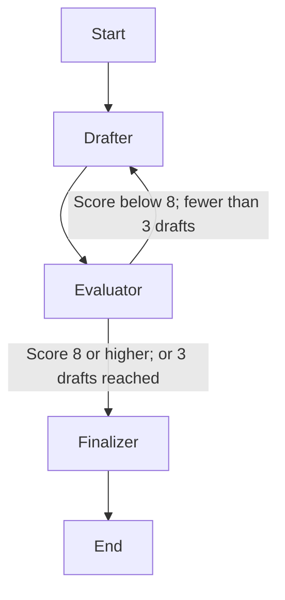

# Email Drafting Assistant

A command-line email drafting project built with LangGraph and Groq. Enter a topic, and the assistant drafts an email, evaluates it, and revises it when needed.

## How it works



- **Drafter:** Writes an email from the topic or revises a draft using feedback.
- **Evaluator:** Returns a score from 1 to 10 and suggestions for improvement.
- **Finalizer:** Saves the latest draft as the final email.
- **SQLite checkpoint:** Saves graph state under a session ID so it can be loaded after restarting the program.

On a new session, the workflow makes up to **three drafts** before finalizing, even if the score stays below 8. Reaching the limit does not guarantee a score of 8.

## Setup

1. Save the Python code as `email_agent.py`.
2. In the same folder, create a virtual environment and install the packages:

   ```bash
   python3 -m venv .venv
   source .venv/bin/activate
   python -m pip install langchain-groq langgraph langgraph-checkpoint-sqlite python-dotenv pydantic
   ```

3. Create a `.env` file in that folder with your [Groq API key](https://console.groq.com/keys):

   ```dotenv
   GROQ_API_KEY=your_api_key_here
   ```

4. Run the program:

   ```bash
   python email_agent.py
   ```

The code uses Groq's `openai/gpt-oss-20b` model. Keep `.env` and `drafts_memory.db` out of Git; the database contains saved drafts. For example, add them to `.gitignore`:

```gitignore
.env
.venv/
drafts_memory.db
```

## Using it

Enter a session ID, then an email topic. The program prints the generated email and asks for changes. Enter `quit` or `exit` to stop. Use the same session ID next time to load its saved draft.

## Current limitations

- The three-draft counter stays with the session. Once it reaches three, later input triggers one new draft and evaluation, then finalization.
- After an email has been finalized, later changes can leave `final_email` holding an older draft. The CLI prefers that field when printing, so it may show the older email instead of the latest revision.
- Text entered after a draft exists is treated as revision feedback, even if it is a new topic. Use a new session ID for a separate email.
- The Program uses GPT-OSS-20B for both drafts and finalization. The program should use a more powerful model for evaluation.
- Exiting Validation and Finalization can be improved.

## What I learned

- How to connect LangGraph nodes with edges and conditional routing.
- How to use Checkpointers and Saving to SQLite.
- How to use evaluator feedback to guide revisions.
- How to limit a revision loop (to prevent Groq Rate limits). and save its state with SQLite checkpoints.

## Wishlist/Roadmap

- Adding a human-in-the-loop feature to the evaluator via interrupt() function.

